

# 프로젝트에 대한 정보

---

### 1. 프로젝트 제목

뉴스와 함께 하는 똑똑한 투자! “**NewStock**”

### 2. 로고 및 이미지

### 3. 프로젝트 정보 🗂

경제 뉴스로 투자 안목을 키우고, 모의 투자로 실전 감각까지 다지는 빅데이터 플랫폼

`SSAFY 11th 빅데이터(분산) PJT`

`개발기간: 24.08.26 ~ 24.10.11 (7주)`

### 4. 배포 주소 🌐

개발버전 : 1. 0. 0

도메인: "newstock.info"

## 프로젝트 소개 🛒

### 개요

Newstock은 주식 투자와 경제 뉴스를 보다 쉽고 효율적으로 접근할 수 있는 빅데이터 기반의 투자 플랫폼입니다. 주식 시장에 관심 있는 사용자들이 방대한 뉴스와 시장 데이터를 손쉽게 분석하고, 모의 투자를 통해 실전 감각을 키울 수 있도록 설계되었습니다. 초보 투자자뿐만 아니라 경험이 있는 투자자들도 투자 인사이트를 얻을 수 있도록 다양한 기능을 제공합니다.

### 기획 배경

많은 투자자들이 주식 투자를 할 때 최신 경제 뉴스와 산업 동향을 참고하지만, 기존의 정보 제공 플랫폼은 정보가 지나치게 많고 비효율적으로 제공되는 경우가 많았습니다. 이를 해결하기 위해, 우리는 뉴스와 주식 정보를 하나의 플랫폼에서 통합하여 누구나 쉽게 이해하고 활용할 수 있도록 기획하였습니다.

## 주요기능 🔍

### 📌 뉴스 제공 기능

    - Newstock은 경제 뉴스를 **'시황 뉴스'**와 **'종목 뉴스'**로 구분하여 제공합니다.
      - 시황 뉴스: 경제와 금융 시장의 거시적인 흐름을 보여주는 뉴스
      - 종목 뉴스: 특정 기업이나 종목의 실적, 이슈와 관련된 뉴스
    - 감정 분석 기술을 통해 뉴스가 긍정적인지 부정적인지를 파악하여 사용자가 더 나은 투자 결정을 할 수 있도록 지원합니다.

### 📌 모의 투자 기능

    - 실제 주식 시장 데이터를 기반으로 가상 포인트를 사용해 모의 투자를 할 수 있습니다.
    - 차트 검색 기능: 사용자가 설정한 기간의 뉴스와 시황을 자동으로 분석 및 요약하여 복잡한 시장 정보를 한눈에 파악할 수 있습니다.
    - 차트 유사도 분석: 과거 주가 패턴과 유사한 차트를 찾아 제공하며, 당시의 뉴스와 시황도 요약해서 보여줍니다.

### 📌 편의 기능

    - 스크랩 기능: 원하는 뉴스를 저장할 수 있습니다.
    - AI 챗봇 기능: 검색 증강 생성을 활용해 필요한 정보를 빠르게 찾을 수 있도록 돕습니다.
    - 랭킹 시스템: 모의 투자에서 높은 수익을 기록한 사용자를 위한 게이미피케이션 요소를 추가했습니다.

## 기술 스택 📖

### Frontend

### Infrastructure

### Backend

### DB

### Data

## 아키텍쳐 📑

  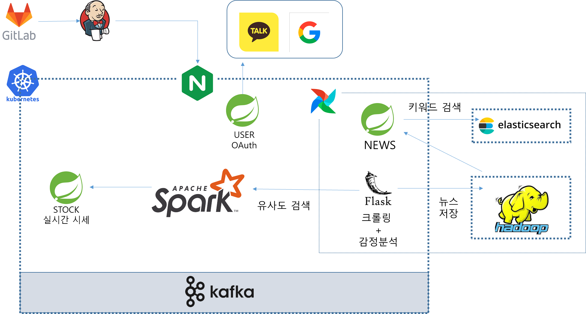

## ERD

  

## 웹사이트 NewStock

### 온보딩(OnBoarding)

  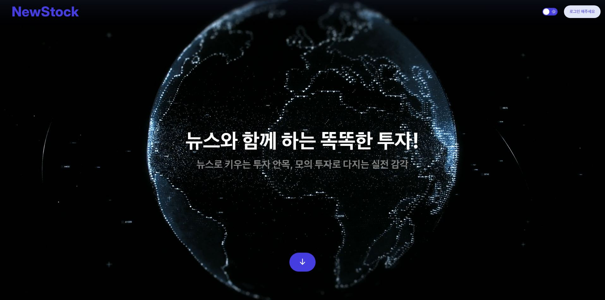

  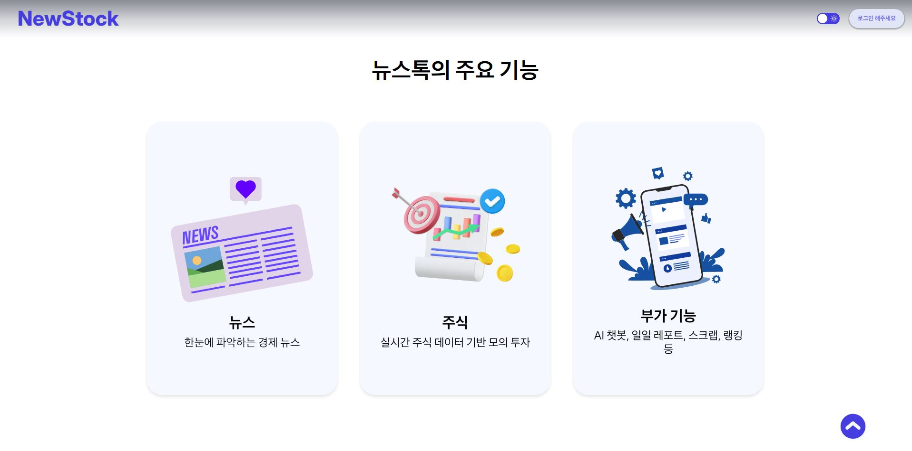

  

  

  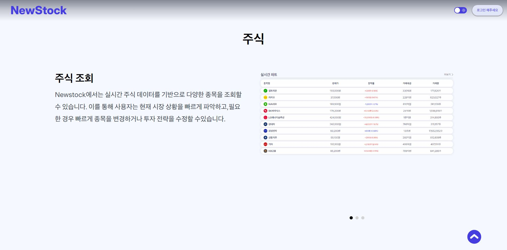

  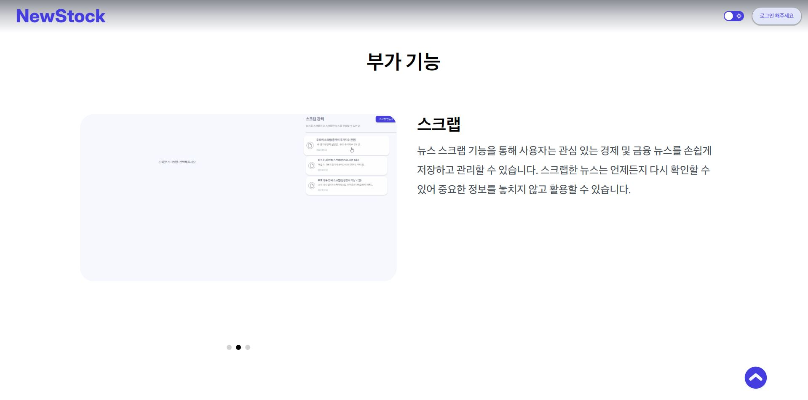
  
  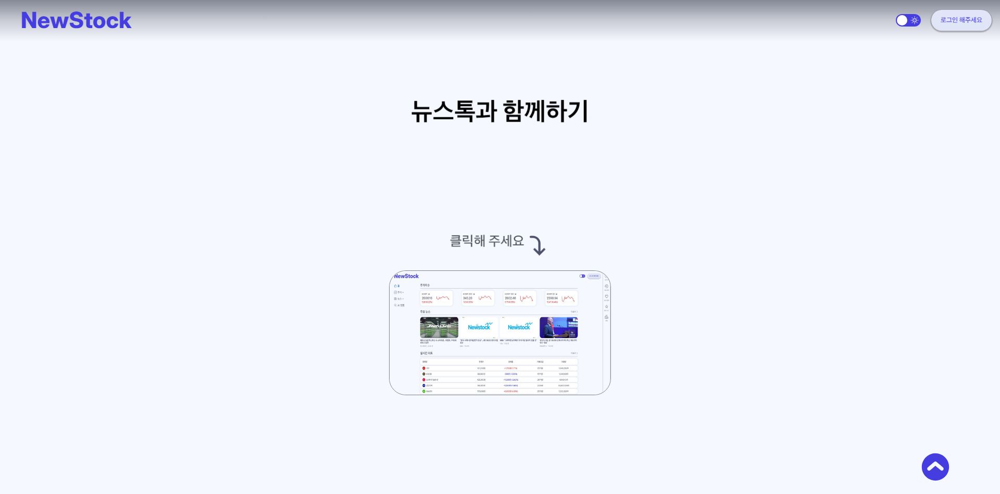

  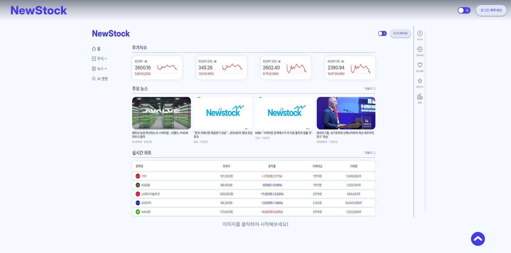

### 홈(Home)

  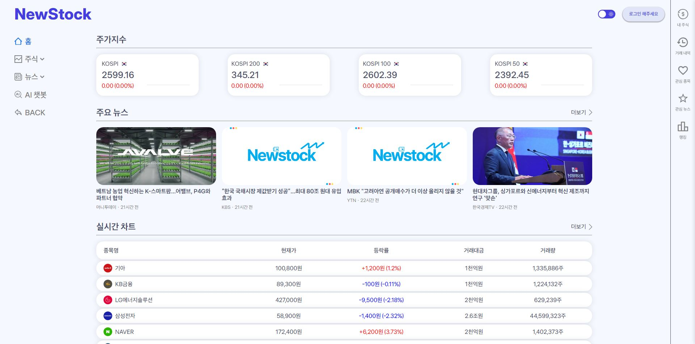

### 주식(Stock)

  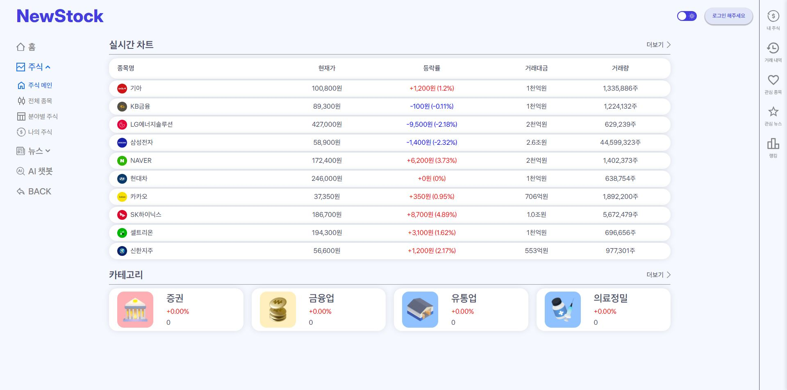

  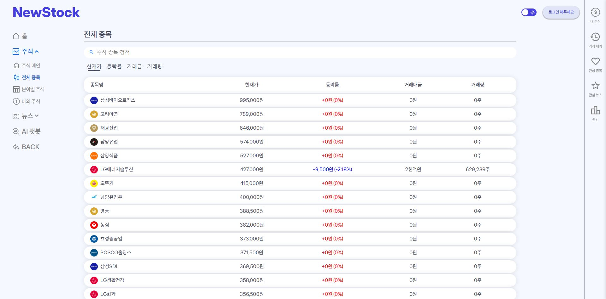

  

  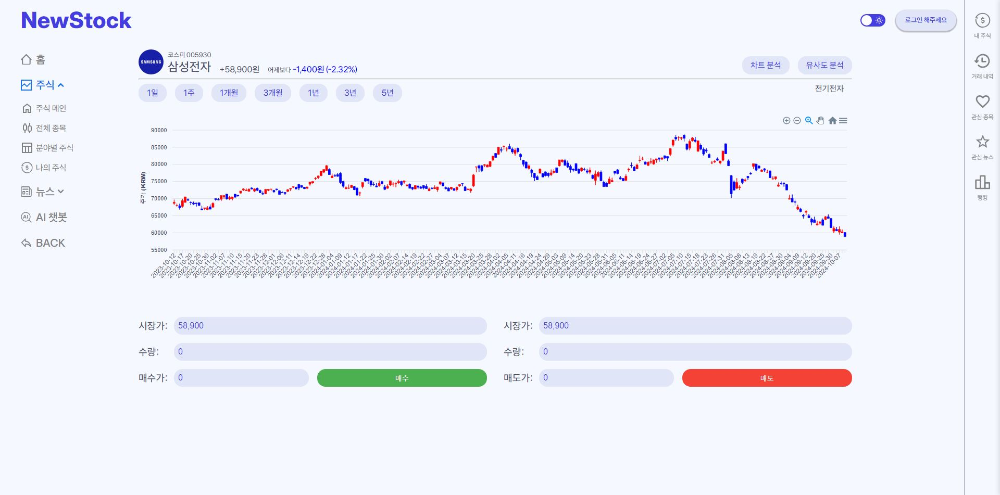

  
  
  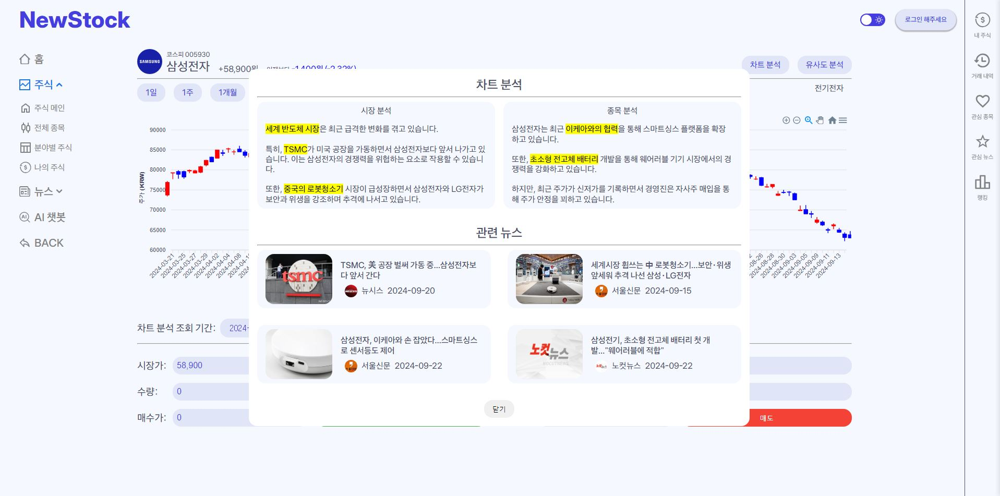

### 뉴스(News)

  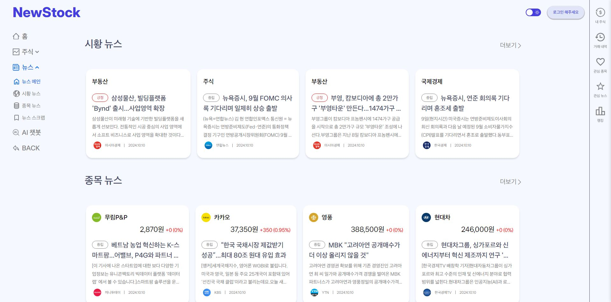

  

  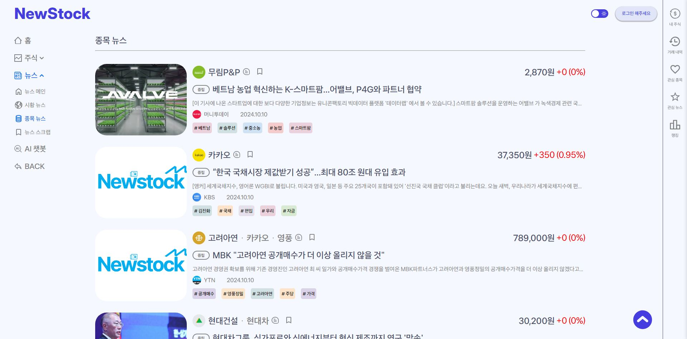

### AI 챗봇(AIChatBot)

  

### 그 외 편의 기능

### NewStock의 차별점 👍

위 표를 통해 담다는 기존의 쇼핑 시스템과 비교하여 다음 다섯가지의 불편함을 해소할 수 있다.

1. 뉴스와 모의 투자의 통합 플랫폼

   - 대부분의 기존 플랫폼은 주식 정보와 경제 뉴스를 개별적으로 제공하거나, 단순한 정보 제공에 그치는 경우가 많습니다. Newstock은 경제 뉴스와 모의 투자를 하나의 플랫폼에서 통합하여 사용자들이 뉴스를 통해 투자 안목을 키우고, 모의 투자로 실전 감각을 다질 수 있도록 지원합니다.

2. 감정 분석을 통한 뉴스 평가

   - 기존의 뉴스 제공 서비스는 뉴스의 양과 범위가 방대하여 사용자가 중요한 정보를 가려내기 어려운 경우가 많습니다. Newstock은 뉴스에 대한 감정 분석을 적용하여 각 뉴스가 긍정적인지 부정적인지 평가하고, 이를 통해 사용자들이 뉴스의 투자 가치를 직관적으로 판단할 수 있도록 돕습니다.

3. AI 기반 차트 검색 및 유사도 분석

   - 일반적인 모의 투자 서비스는 기본적인 거래 기능에 국한되어 있지만, Newstock은 AI 기반 차트 검색과 유사도 분석을 제공하여 보다 정교한 투자 전략 수립을 지원합니다. 사용자가 설정한 기간의 뉴스와 시황을 자동으로 분석하고 요약해주며, 과거 주가 패턴과 유사한 차트를 탐색해 투자 전략에 참고할 수 있도록 합니다.

4. 실시간 데이터 처리와 분산 시스템 도입

   - Newstock은 HDFS와 Spark 등 분산 처리 시스템을 활용하여 대량의 뉴스와 주가 데이터를 실시간으로 빠르게 처리합니다. 이로 인해 기존 RDBMS 기반 시스템보다 더욱 신속하고 안정적으로 데이터를 제공할 수 있습니다.

5. 다양한 편의 기능과 게이미피케이션 요소

   - Newstock은 투자자들이 더 효율적으로 플랫폼을 사용할 수 있도록 스크랩 기능, AI 챗봇, 랭킹 시스템 등 다양한 편의 기능을 제공하며, 게이미피케이션 요소를 통해 사용자가 모의 투자를 즐기면서 실전 감각을 키울 수 있도록 유도합니다.

## 시연 영상

### NewStock 영상

## 팀 소개 👨‍👨‍👦

<table>
  <tbody>
    <tr>
      <td align="center">
        
         
        <b>BE/DATA 팀장 : 박선홍</b>
      </td>
      <td align="center">
        
         
        <b>BE LEADER 부팀장 : 고민호</b>
      </td>
      <td align="center">
        
         
        <b>BE/INFRA 팀원 : 손지석</b>
      </td>
    </tr>
    <tr>
      <td>
        <ul>
          <li><strong>SSAFY 11th Java</strong></li>
          <li>뉴스 데이터 수집 및 처리</li>
          <li>분산 처리 파이프 라인 구축</li>
        </ul>
      </td>
      <td>
        <ul>
          <li><strong>SSAFY 11th Java</strong></li>
          <li>모의 투자 서버 담당</li>
          <li>채워주세용</li>
        </ul>
      </td>
      <td>
        <ul>
          <li><strong>SSAFY 11th Java</strong></li>
          <li>인프라 담당</li>
          <li>채워주세용</li>
        </ul>
      </td>
    </tr>
    <tr>
      <td align="center">
        
         
        <b>FE LEADER 팀원 : 이명욱</b>
      </td>
      <td align="center">
        
         
        <b>FE 팀원 : 이정준</b>
      </td>
      <td align="center">
        
         
        <b>FE 팀원 : 이주호</b>
      </td>
    </tr>
    <tr>
      <td>
        <ul>
          <li><strong>SSAFY 11th Python</strong></li>
          <li>모의 투자 담당</li>
          <li>프론트 환경 구축</li>
        </ul>
      </td>
      <td>
        <ul>
          <li><strong>SSAFY 11th Python</strong></li>
          <li>뉴스 담당</li>
          <li>스크랩 담당</li>
        </ul>
      </td>
      <td>
        <ul>
          <li><strong>SSAFY 11th Python</strong></li>
          <li>마이 페이지 담당</li>
          <li>사이드 바 담당</li>
        </ul>
      </td>
    </tr>
  </tbody>
</table>

